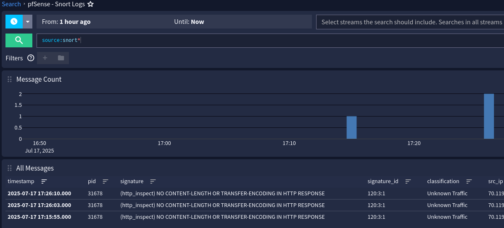

# Graylog Extractor for Snort on pfSense

## Description
Snort field extraction from pfSense sys logs for parsing in Graylog. This is only for IDS detections and not other general snort logs.

## Requirements
- N/A

## Usage
- WIP

## Author
* JA Salinas
