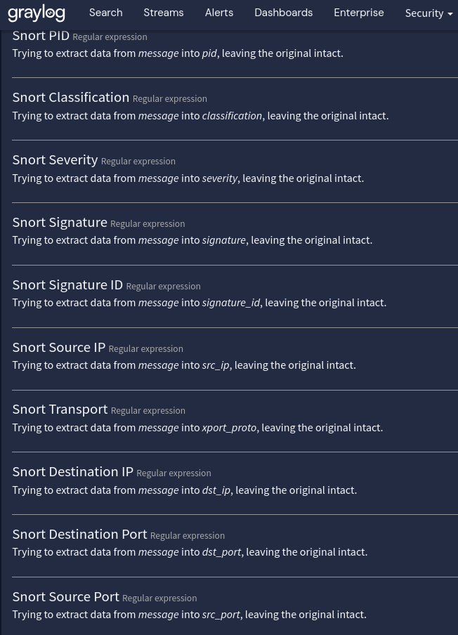

# Graylog Extractor for Snort on pfSense

## Description
Snort field extraction from pfSense sys logs for parsing in Graylog. This is only for IDS detections and not other general snort logs.

## Requirements
N/A

## Usage
- Step 1: Navigate to System > Inputs.

- Step 2: Click on Manage Extractors for the input you want to work with.

- Step 3: Clicl Actions > Import Extractors.

- Step 4: Paste in JSON and click Add Extractors to Input.

It should show that it completed successfully and the new extractors should now be available.

## Author
* JA Salinas
